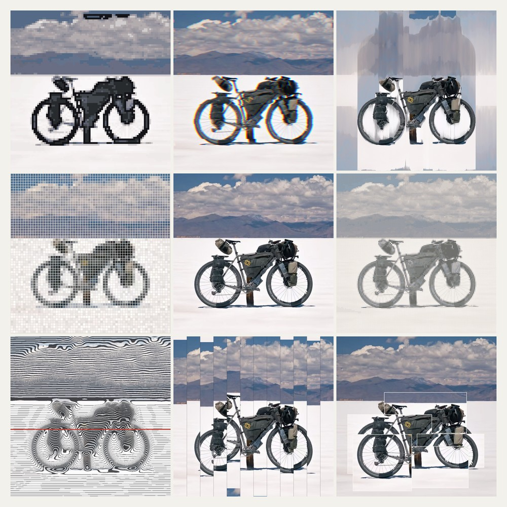
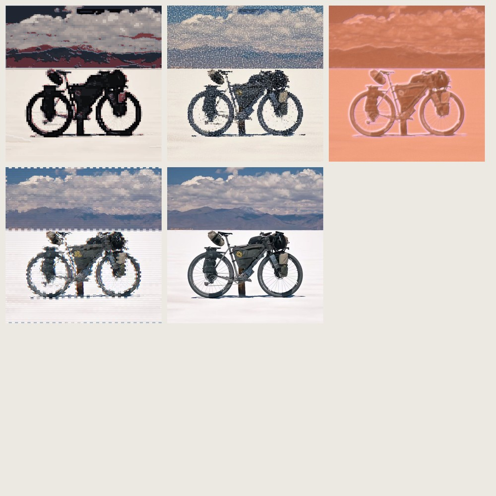
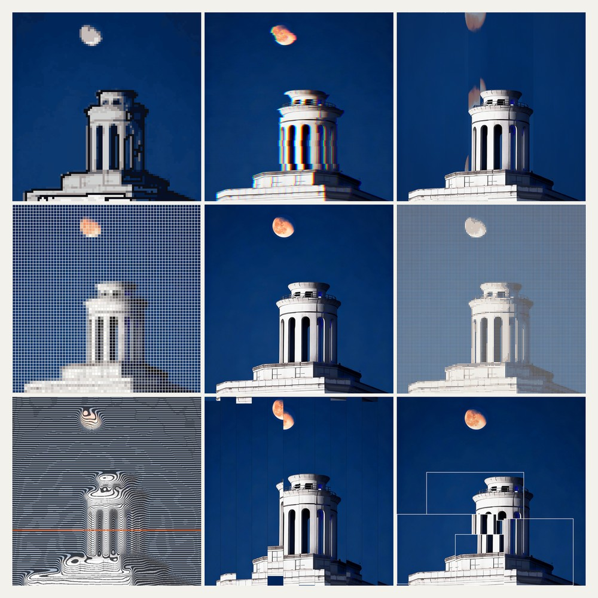
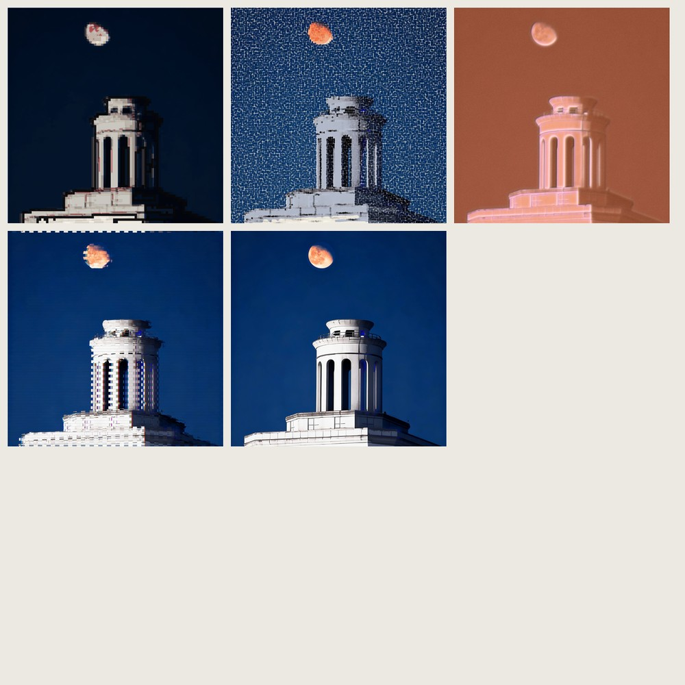
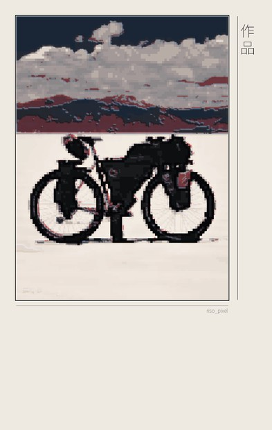
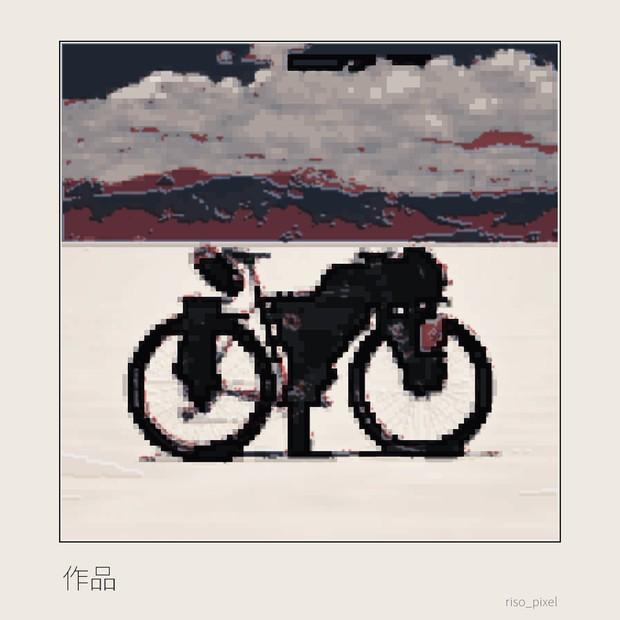
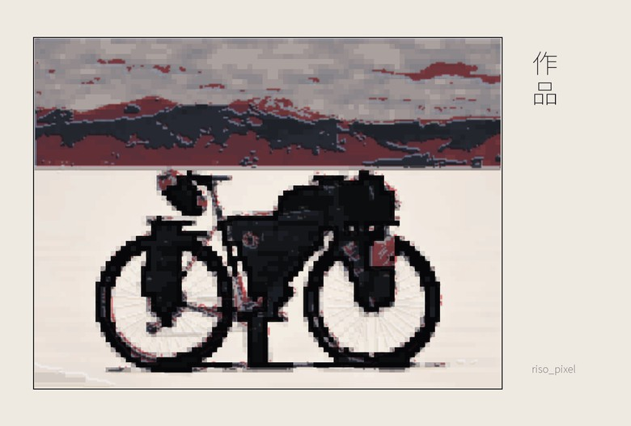
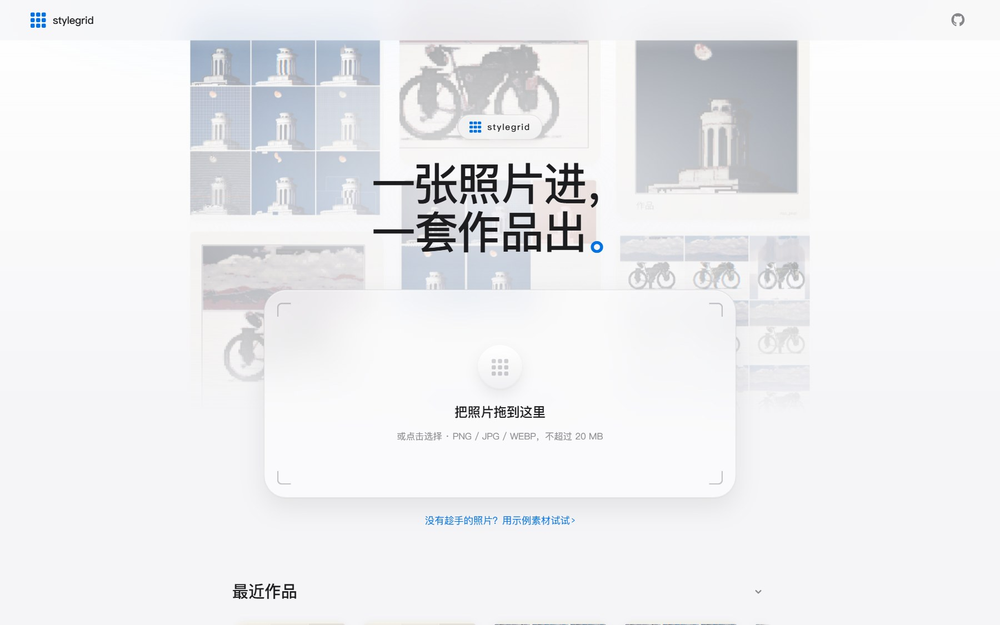
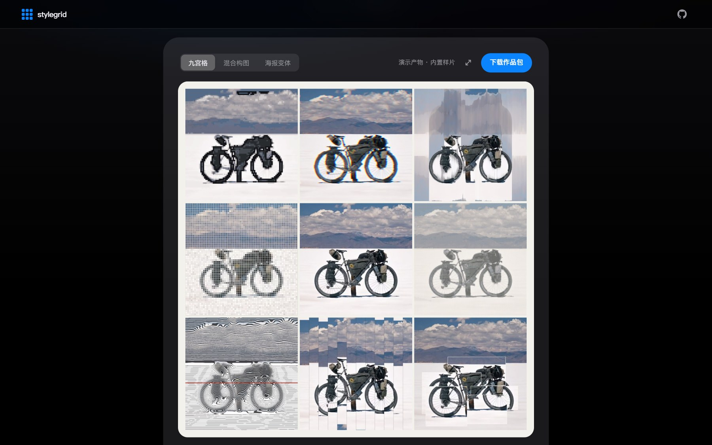

<div align="center">


# stylegrid

**One photo in, a full set out.**

**51 art styles · 16 hybrid recipes · V/S/H poster layouts · images only · automatic quality gate.**


[Quickstart](#quickstart) · [Gallery](#gallery) · [What's inside](#whats-inside) · [Quality gate](#quality-gate) · [中文](README.md)

</div>

---

## Why stylegrid

| Principle | How |
|---|---|
| **Never mushy** | The subject boundary comes from *edge-fit measurement* (does the contour sit on real image edges?) plus object-level segmentation. **Negative space is preserved** — wheel interiors and frame triangles stay open, so the silhouette still reads as a bike. A cast shadow as dark as the subject is removed by a *texture + shape* test |
| **Evidence, not vibes** | Every output gets a **trace score** (`0.65 × \|32×32 luma-layout correlation\| + 0.35 × colour proximity`). Styles below the bar never enter the default pool; each report lists per-piece scores |
| **Closed loop** | End-to-end workflow test (artifact completeness → score pass-rate → non-degeneracy) plus a style-library regression test. Nothing ships without passing both |

It actually looks at your photo: luminance, saturation, subject shape and whether a real light source exists decide the style set **and** the palette — night shots automatically switch to dark palettes.

---

## Quickstart

```bash
git clone https://github.com/Sutera-Diffusus/stylegrid
cd stylegrid
pip install -r requirements.txt

python workflow.py --src your_photo.jpg --out out/auto
```

```
out/auto/
├── 01_九宫格.png    nine-grid (8 styles + original)
├── 02_混血格.png    hybrid recipe grid
├── 03_海报_V.png    text-free poster
└── report.md        analysis + per-piece trace scores + file list
```

Customise at three levels:

```bash
python workflow.py --src p.jpg --out out/x --profile 印刷        # built-in profile
python workflow.py --src p.jpg --out out/x \
    --styles pixel_E,glitch_E,cross_E --mixes riso_pixel,ink_point --posters V,S,H
python workflow.py --list                                       # 51 styles / 16 recipes / 6 profiles
```

---

## Gallery

**Salt-flat cycling** (daylight, no light source) — auto-picked pixel / glitch / collage family:

| nine-grid | hybrid grid |
|---|---|
|  |  |

**Tower under the moon** (night, moon detected) — palettes auto-switched to dark:

| nine-grid | hybrid grid |
|---|---|
|  |  |

**Poster layouts** (text-free by default; add `--title` to enable a vertical title column):

| V | S | H |
|---|---|---|
|  |  |  |

---

## What's inside

**51 styles in four families** — photo-faithful (pixel, dotmatrix, mosaic, cross-stitch, quilt, strips,
collage, film, glitch, pixel-sort, motion, polar vortex, scanlines, halftone, pointillism, newsprint,
weave, stamp, light-leak, fauvism, mis-registered riso, futurism) · graphic silhouette (flat, hard-edge,
papercut, ink-minimal, line-art, blocks, shards, pattern, deco) · print & colour (riso 4-colour,
engraving, cyanotype, duotone, negative, mirror, foil emboss, neon, rothko, dada) · abstract (bauhaus,
suprematism, de stijl, op art, kandinsky, action painting, cubism, colour field, constructivism, minimal).

**16 hybrid recipes** — 8 blend modes (`NRM/MUL/SCR/OVR/LGT/DRK/ADD/DIF`) × 3 scopes
(`A` all / `S` subject only / `B` background only), weights adjustable:

```bash
python mixposter.py --src p.jpg --out out/ --one "pixel_E*1+risomis_A:MUL@B"
```

**3 poster layouts** (V portrait / S square / H landscape), text-free by default.

**Manual fallback** when auto-segmentation struggles:

```bash
python workflow.py --src p.jpg --out out/x --mode poly --poly "120,600;380,600;380,140"
python workflow.py --src p.jpg --out out/x --mode mask --mask fg.png
```

---

## Quality gate

```
trace score = 0.65 × |luma-layout correlation| + 0.35 × colour proximity   (1.0 = identical to source)
```

Measured on real photos: **21 styles ≥0.85 · 19 in 0.50–0.85 · 11 below 0.50**
(mostly deliberate monochromes or free abstractions — still callable via `--order`).
15 of 16 hybrid recipes score ≥0.70.

```bash
python e2e_test.py your_photo.jpg   # closed loop (self-contained with no args)
python selftest.py                  # style-library regression over 10 content types
```

Latest runs: **e2e 4/4 PASS** (min trace 0.81–0.86, 100 % pass-rate) · **regression 10/10 PASS**.

---

## Privacy

Everything runs locally. No network calls, no uploads, no telemetry — your photos never leave your machine.

---

## Repo layout

```
├── workflow.py      one-stop entry: analyse → pick styles → grids/hybrids/posters → QA report
├── gridkit.py       renderer core: 51 styles, 5 palettes, adaptive segmentation, smart suggest
├── mixposter.py     hybrid engine (blend modes × scopes) + layout system
├── app/             local web studio (server.py + single-page UI, zero deps)
├── promo/           promo-film generator (make_promo.py, PIL frame renderer)
├── selftest.py      style-library regression
├── e2e_test.py      closed-loop workflow test
├── docs/            full style catalogue + trace-score tables (Chinese)
└── samples/         README previews
```

## Local web studio

Prefer a GUI? The repo ships a local single-page studio (drag a photo in → pick a style card → generate):

| Light · guided home | Dark · result gallery |
|---|---|
|  |  |

**Step-by-step guide (Chinese): [网页版教程 →](docs/网页版教程.md)**

```bash
python app/server.py              # http://127.0.0.1:8765/
python app/server.py --port 8791  # pick another port if busy
```

Style presets are thumbnail cards; "自定义" opens the full 51-style multi-select pool.
Recent works are read from `out/web/` — drag to scroll, click to revisit, download the whole set.
Same engine as the CLI: `POST /api/generate` runs `workflow.run(...)` and writes to `out/web/`.

**Promo film**: a 15-second self-contained product short rendered frame by frame with PIL:

```bash
python promo/make_promo.py        # promo/out/stylegrid_promo.mp4 + contact sheet + JSON
```

## Development conventions

Add a style → run `e2e_test.py` for its trace score → **only ≥0.50 styles join the default pool**;
below that they stay available via `--order`.

## License

[MIT](LICENSE)
