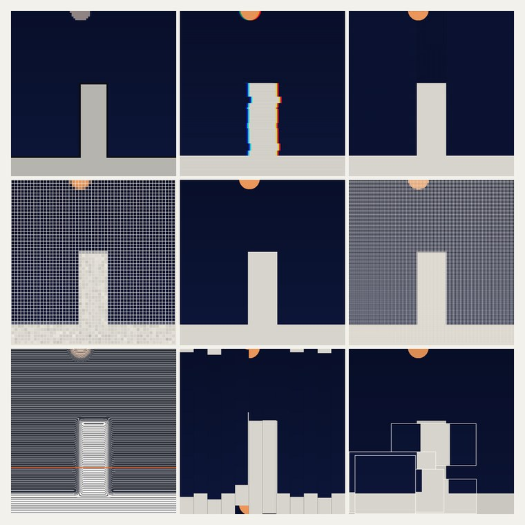
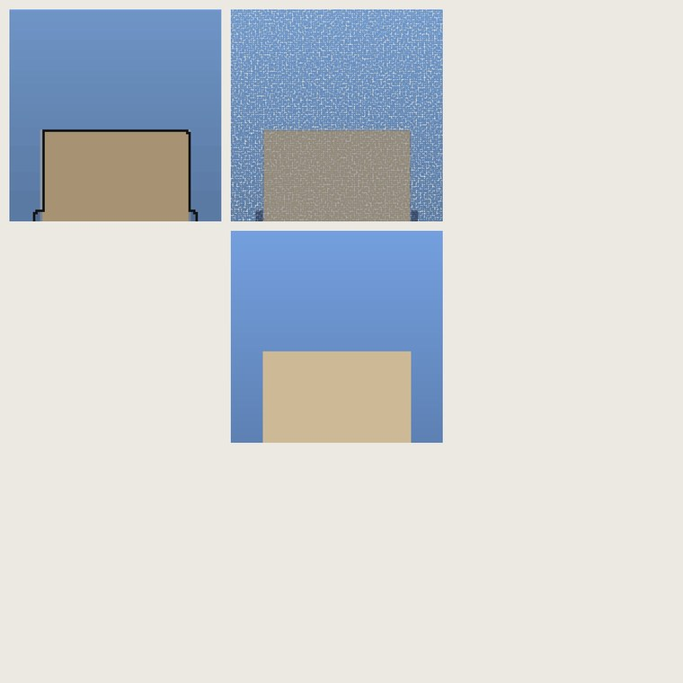
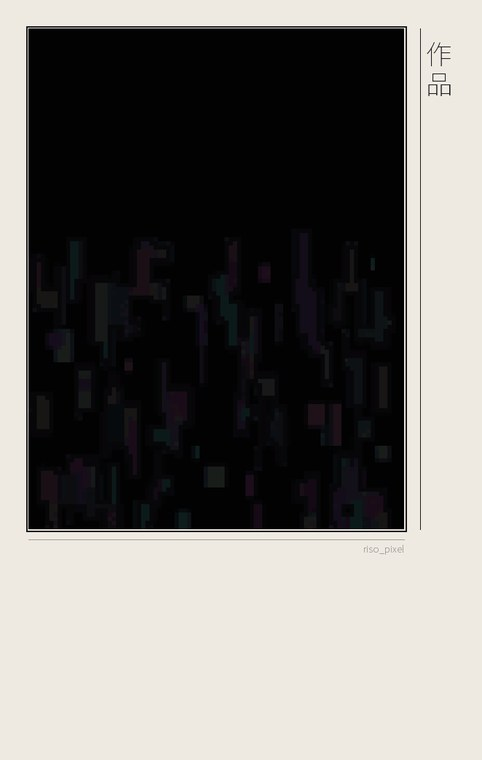

# stylegrid

**一张照片进，一套作品出** —— 51 种艺术风格九宫格 · 16 个混血配方 · 三段海报版式 · 全自动质检。

> **One photo in, a full set out.** 51 art styles, 16 hybrid recipes, three print layouts,
> plus a built-in quality gate that measures how much of the original each piece still carries.

<p align="center">
  
  
  
</p>

---

## 这是什么

给一张照片，自动完成：

1. **读图分析** —— 自适应主体分割（蓝通道 → 边缘连通 → 显著性 三级降级）、光源/月亮检测、
   天空/主体/明暗覆盖率统计；按比例中心裁切（`3:4 / 1:1 / 4:3`，绝不拉伸）；
2. **选风格** —— 按画面明暗、饱和度、主体形态、有无光源自动挑八格（内置"像素 / 拼接 / 故障 /
   点彩 / 马赛克 / 十字绣优先"的口味权重），也可以手动点名任意风格；
3. **出成品**（**纯图片，不含文字设计**）—— 九宫格 / 混血格 / 海报竖版·方版·横版；
4. **质检** —— 对每件成品算"**原作痕迹分**"，低于阈值当场标记，报告随成品一起落盘。

## 30 秒上手

```bash
pip install -r requirements.txt

python workflow.py --src photo.jpg --out out/auto                 # 全自动
python workflow.py --src photo.jpg --out out/print --profile 印刷  # 用预设
python workflow.py --list                                        # 列全部风格/配方/预设
```

产物：

```
out/auto/
├── 01_九宫格.png      八格 + 原图对照
├── 02_混血格.png      风格混血 3×3
├── 03_海报_V.png      版式海报（纯图片）
└── 报告.md            画面分析 + 逐件痕迹分 + 文件清单
```

## 闭环测试（实测）

| 测试 | 结果 |
|---|---|
| 工作流端到端（2 张不同照片 × 2 种配置） | **4/4 PASS**（痕迹分 min 0.81–0.86，达标率 100%） |
| 风格库回归（10 类内容） | **10/10 PASS** |

```bash
python e2e_test.py photo1.jpg photo2.jpg    # 闭环：工作流 → 产物完整性 → 痕迹分 → 非退化
python selftest.py                          # 风格库回归（合成边界用例 + 工作区样图）
```

## 风格库（51 种，按痕迹分标注）

> 痕迹分 = `0.65 × |32×32 亮度布局相关系数| + 0.35 × 色彩接近度`，1.0 = 与原作完全一致。
> 实测样本：盐湖骑行照片（白天·无光源）+ 夜塔照片（夜景·有光源）。

**分档：强痕迹 ≥0.85 共 21 种 · 中痕迹 0.50–0.85 共 19 种 · 弱痕迹 <0.50 共 11 种**
（弱痕迹多为**刻意单色**或"意译"级抽象，仍可手动调用。）

| 风格键 | 名称 | 痕迹分 | 家族 |
|---|---|---|---|
| `pixel` | 像素画 | 0.97 | 照片保真 |
| `dotmatrix` | 点阵印刷 | 0.89 | 照片保真 |
| `mosaic` | 马赛克 | 0.95 | 照片保真 |
| `cross` | 十字绣 | 0.93 | 照片保真 |
| `quilt` | 拼布 | 0.97 | 照片保真 |
| `strips` | 拼接条带 | 0.94 | 照片保真 |
| `collage` | 照片拼贴 | 0.95 | 照片保真 |
| `film` | 胶片接触印相 | 0.93 | 照片保真 |
| `glitch` | 故障化 | 0.98 | 照片保真 |
| `pixelsort` | 像素排序故障 | 0.97 | 照片保真 |
| `motion` | 拖影 | 0.89 | 照片保真 |
| `polar` | 极坐标 | 0.71 | 照片保真 |
| `scanlines` | 扫描色带 | 0.62 | 照片保真 |
| `halftone` | 网点 | 0.61 | 照片保真 |
| `pointillism` | 点彩 | 0.98 | 照片保真 |
| `newsprint` | 报纸粗网 | 0.90 | 照片保真 |
| `weave` | 织锦 | 0.95 | 照片保真 |
| `stamp` | 邮票拼版 | 0.96 | 照片保真 |
| `lightleak` | 胶片漏光 | 0.97 | 照片保真 |
| `fauve` | 野兽派 | 0.90 | 照片保真 |
| `risomis` | 错版套印 | 0.81 | 照片保真 |
| `futurism` | 未来主义 | 0.79 | 照片保真 |
| `flat` | 剪纸平涂 | 0.57 | 图形剪影 |
| `hardedge` | 硬边剪影 | 0.56 | 图形剪影 |
| `papercut` | 剪纸层叠 | 0.52 | 图形剪影 |
| `inkmin` | 极简墨线 | 0.31 | 图形剪影 |
| `lineart` | 轮廓线稿 | 0.39 | 图形剪影 |
| `blocks` | 色块分割 | 0.89 | 图形剪影 |
| `shards` | 碎片棱镜 | 0.40 | 图形剪影 |
| `pattern` | 重复图案 | 0.29 | 图形剪影 |
| `deco` | 放射装饰 | 0.53 | 图形剪影 |
| `riso4` | 四色套印 | 0.42 | 印刷色彩 |
| `engraving` | 线刻版画 | 0.39 | 印刷色彩 |
| `cyanotype` | 蓝晒 | 0.76 | 印刷色彩 |
| `duotone` | 双色渐变 | 0.67 | 印刷色彩 |
| `negative` | 负片 | 0.86 | 印刷色彩 |
| `mirror` | 镜像 | 0.60 | 印刷色彩 |
| `foil` | 烫金压印 | 0.66 | 印刷色彩 |
| `neon` | 霓虹描边 | 0.46 | 印刷色彩 |
| `rothko` | 竖直色光 | 0.36 | 印刷色彩 |
| `dada` | 达达拼贴 | 0.67 | 印刷色彩 |
| `bauhaus` | 包豪斯几何 | 0.39 | 抽象主义 |
| `supremat` | 至上主义 | 0.40 | 抽象主义 |
| `destijl` | 风格派 | 0.63 | 抽象主义 |
| `opart` | 光效应 | 0.90 | 抽象主义 |
| `kandinsky` | 康定斯基 | 0.32 | 抽象主义 |
| `splatter` | 行动绘画 | 0.90 | 抽象主义 |
| `cubism` | 立体主义 | 0.69 | 抽象主义 |
| `colorfield` | 色域 | 0.54 | 抽象主义 |
| `construct` | 构成主义 | 0.57 | 抽象主义 |
| `minimal` | 极简几何 | 0.50 | 抽象主义 |

## 混血配方（16 个）

引擎：多风格图层叠加，支持 8 种混合模式 `NRM/MUL/SCR/OVR/LGT/DRK/ADD/DIF` × 三种作用域
`A` 整体 / `S` 仅主体 / `B` 仅背景（用主体掩版分区），权重可调。

自写叠加式：`--one "pixel_E*1+risomis_A:MUL@B"`（`风格_配色 * 权重 : 模式 @ 作用域`，`+` 连接）。

| 配方 | 痕迹分 |
|---|---|
| `ink_point` | 0.95 |
| `glitch_weave` | 0.94 |
| `split_weave_neon` | 0.94 |
| `print_cross` | 0.92 |
| `lgt_mosaic_glitch` | 0.92 |
| `split_riso_fauve` | 0.89 |
| `riso_pixel` | 0.89 |
| `mosaic_opart` | 0.87 |
| `dif_cross_opart` | 0.84 |
| `leak_riso` | 0.79 |
| `split_risomis_flat` | 0.79 |
| `split_flat_pixel` | 0.77 |
| `destijl_pixel` | 0.75 |
| `neon_foil` | 0.71 |
| `stamp_dada` | 0.70 |
| `cubism_scan` | 0.47 |

其中 `split_*` 系列最有意思：**背景与主体用两套完全不同的语言**（例：背景野兽派狂色，主体保持套印写实）。

## 海报版式

| 版式 | 结构 |
|---|---|
| **V 竖版** | 画作居中偏上 + 宽纸边 + 细框 |
| **S 方版** | 画作居中 + 四面留白 |
| **H 横版** | 画作居左 + 右侧留白 |

默认**纯图片无文字**；需要题签（竖排标题 + 说明条）时传 `--title "标题" --sub "副题"` 即启用。

## 预设

| 预设 | 风格族 | 配方 | 版式 |
|---|---|---|---|
| 照片保真 | 像素·故障·拼贴·条带·织锦·点彩·粗网·马赛克 | riso_pixel · glitch_weave · ink_point | V |
| 印刷 | 套印·粗网·十字绣·网点·线刻·扫描带·邮票·烫金 | print_cross · leak_riso · stamp_dada | S |
| 抽象 | 光效应·泼彩·立体·风格派·涡镜·色域·色块·网点 | mosaic_opart · dif_cross_opart | H |
| 剪影 | 平涂·硬边·剪纸·极简 ×2 配色 | split_flat_pixel · split_risomis_flat | V |
| 织品 | 十字绣·拼布·织锦·胶片·马赛克·点阵·像素·条带 | lgt_mosaic_glitch · split_weave_neon | S |
| 全都要 | auto | 8 个主力配方 | V,S,H |

改 `workflow.py` 里的 `PROFILES` 字典即可增删（也可以把常用风格固定成"我的预设"）。

## 命令行速查

```bash
# 九宫格（指定风格）
python gridkit.py --src photo.jpg --out out/ --order pixel_E,glitch_E,cross_E --aspect 1:1

# 单张
python gridkit.py --src photo.jpg --out out/ --single risomis_A

# 全部风格
python gridkit.py --src photo.jpg --out out/ --all

# 混血九宫格
python mixposter.py --src photo.jpg --out out/ --mix riso_pixel,ink_point

# 海报（纯图片 / 带题签）
python mixposter.py --src photo.jpg --out out/ --poster V --style riso_pixel
python mixposter.py --src photo.jpg --out out/ --poster V --style riso_pixel --title "标题" --sub "副题"
```

手动兜底（自动分割不理想时）：`--mode poly --poly "x1,y1;x2,y2;…"` 或 `--mode mask --mask fg.png`。

## 项目结构

```
.
├── workflow.py       一站式入口：分析 → 选风格 → 出九宫格/混血/海报 → 质检报告
├── gridkit.py        渲染主库：51 种风格 + 5 组配色 + 主体分割 + 智能推荐
├── mixposter.py      混血引擎（混合模式 × 作用域）+ 版式系统
├── selftest.py       风格库回归测试（多图自动判定失败/退化）
├── e2e_test.py       工作流闭环测试
├── docs/风格清单.md   全风格说明 + 痕迹分总表
└── samples/          README 用的样例成品
```

## 已知限制

- 主体分割最后一段（阴影与车身同亮度时）靠"纹理 + 形状"判据，**极端逆光/低对比**照片仍可能不够干净，
  此时建议 `--mode poly` 手给一条主体多边形；
- 痕迹分是**布局级**指标：坐标重映射类风格（如极坐标涡镜）与刻意单色风格天然偏低，不代表不可用；
- 全部风格都是**纯图片输出**，不含文字排版（需要题签时才启用）。

## 依赖

`numpy` · `opencv-python` · `Pillow` · `scipy`（Python 3.10+；Windows / macOS / Linux 均可，字体缺失时自动回退）

## License

MIT
