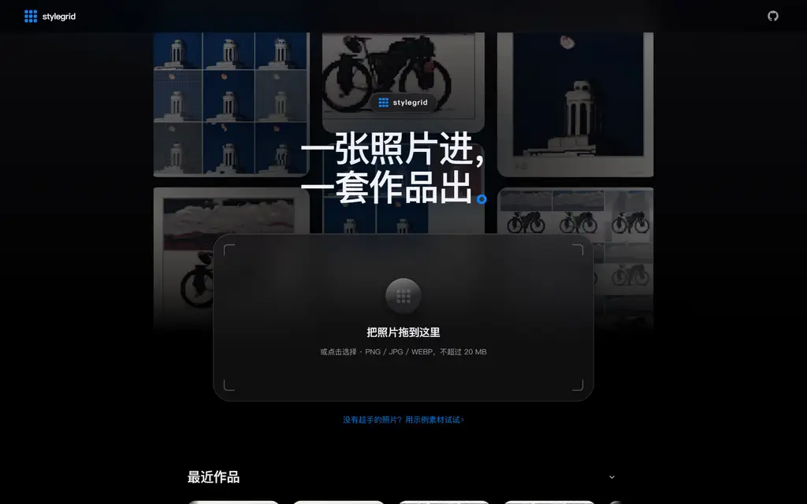
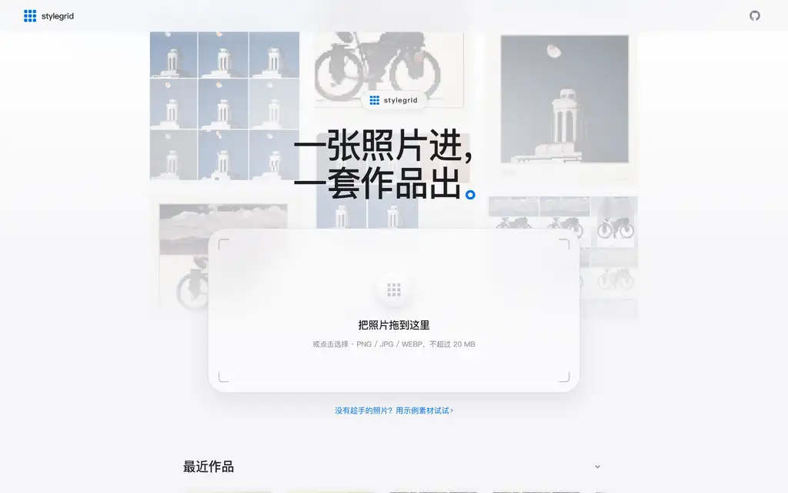
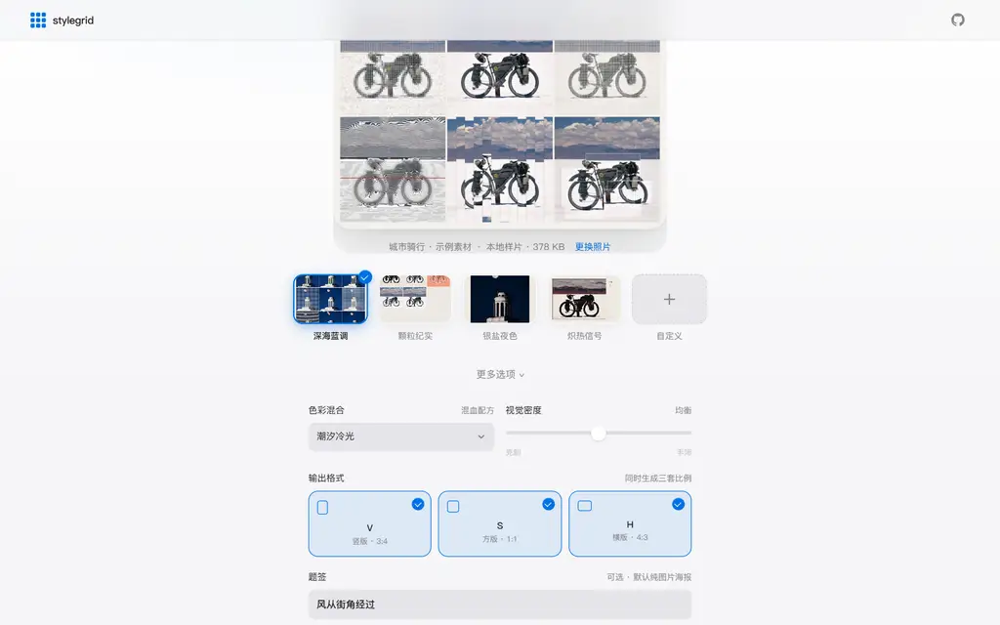
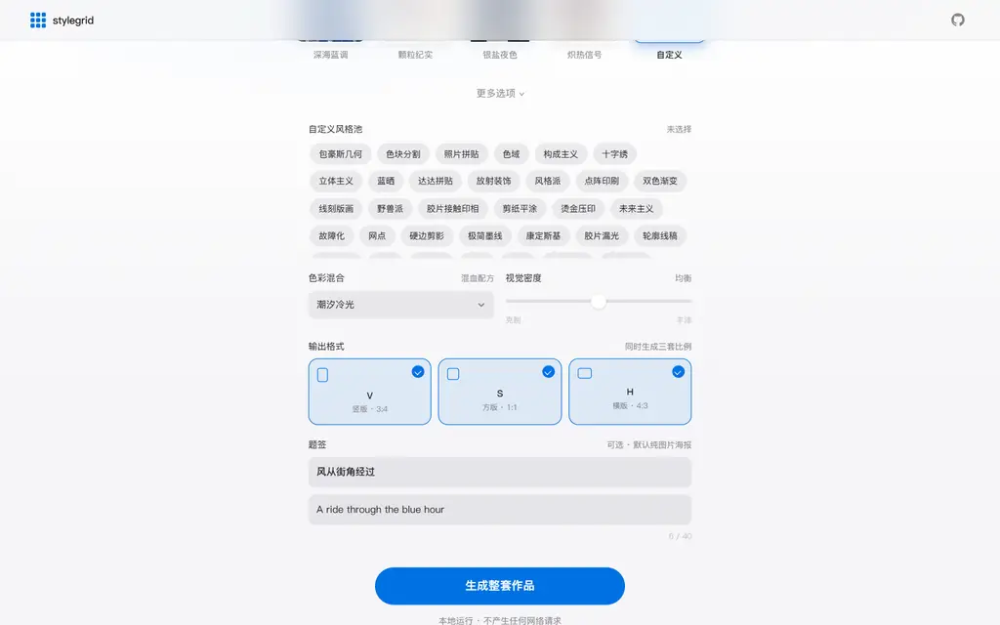
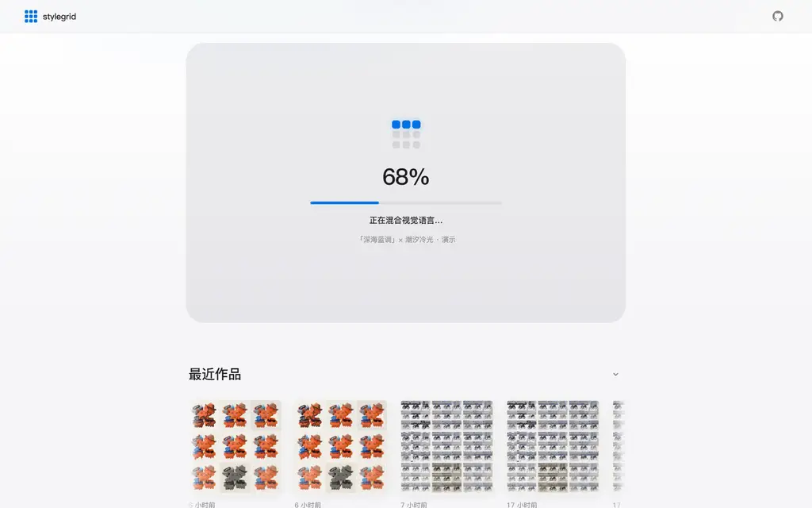
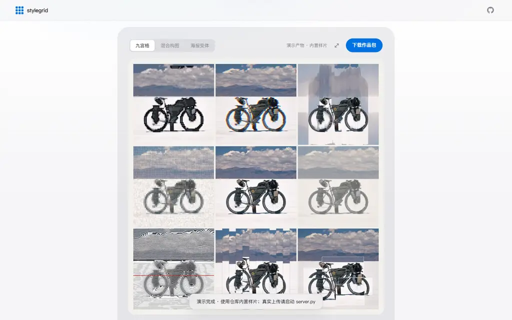
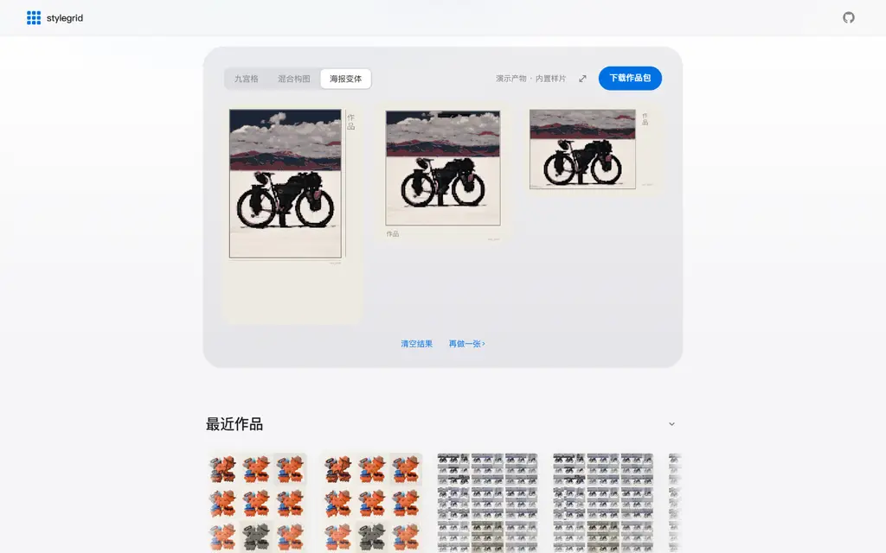
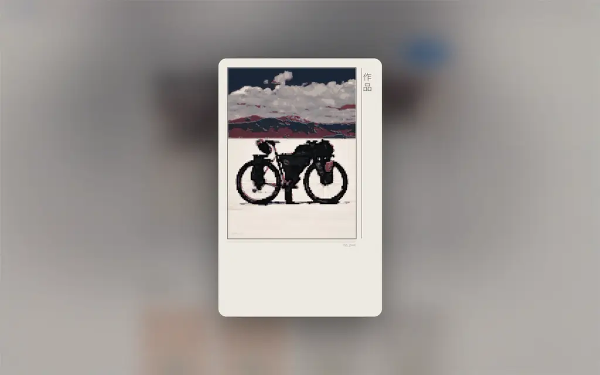
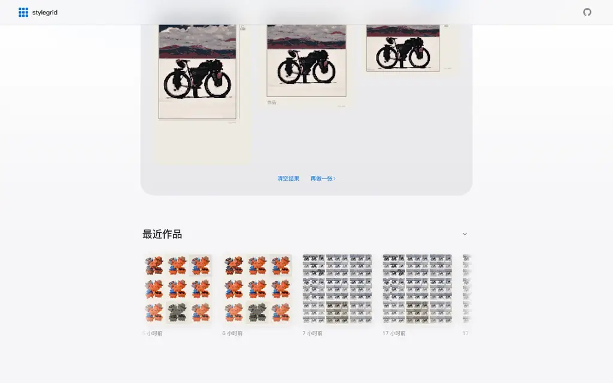

# 网页版教程 · stylegrid 本地 Web 工作室



stylegrid 除了命令行，还自带一个本地 Web 工作室：同一套引擎，图形界面操作。
**全部本地运行,素材不离开这台设备。**

## 启动

```bash
python app/server.py              # 打开 http://127.0.0.1:8765/
python app/server.py --port 8791  # 端口被占用时换一个
```

浏览器打开后会自动跟随系统的浅色 / 深色模式。

## 第 1 步 · 首页



打开就是引导首页：背后是流动的真实作品光墙，中间一个拖放落点。
没有素材时，点下方「用示例素材试试 ›」直接进入下一步。

## 第 2 步 · 放入照片



把照片**拖到窗口任意位置**松手即可（不用瞄准落点），或点击落点从设备选择。
照片就位后，界面会长出下一步：风格选择。下方五个缩略图卡是预设基调，所见即所得。

## 第 3 步 · 自定义风格(可选)



选中「自定义」卡片会自动展开**全部 51 种风格**的多选池，随意组合(至多取前 8 种)。
「更多选项」里还能调色彩混合配方、视觉密度、V / S / H 画幅与题签文案。
什么都不调也完全没问题——预设已经配好了一套。

## 第 4 步 · 生成



点「生成整套作品」。进度九宫格逐格点亮，一般数秒完成。
(命令行引擎全速跑一张照片约 10–40 秒,取决于风格组合。)

## 第 5 步 · 结果画廊



结果直接装裱进画廊：**九宫格 / 混合构图 / 海报变体** 用分段控件切换。
右上角一键「下载作品包」(zip 含全部产物与质检报告)。

## 第 6 步 · 海报变体



竖版 V、方版 S、横版 H 三段海报并排展示，默认纯图片零文字；
在「更多选项」里填了题签才会带上标题。

## 第 7 步 · 大图查看



点击任意图片进入大图模式：背景会化作这张照片的环境光晕。
`←` `→` 切换同组图片,`Esc` 或点击空白处返回。

## 第 8 步 · 最近作品



历史生成自动出现在首页下方「最近作品」：按住拖拽或滚轮横滑，
点任意一张即可回看整套产物。右上角 chevron 可收起，刷新后保持。

## 小贴士

- **快捷键**:题签输入框里 `⌘/Ctrl + ↵` 直接生成
- **换照片**:任何时候把新图拖进窗口即替换
- **再做一张**:结果区底部「再做一张 ›」回到落点
- 没有启动 `server.py` 也能打开 `app/index.html`,但只能浏览内置样片演示

---

遇到问题?回 [README](../README.md) 看命令行用法,或提 Issue。
